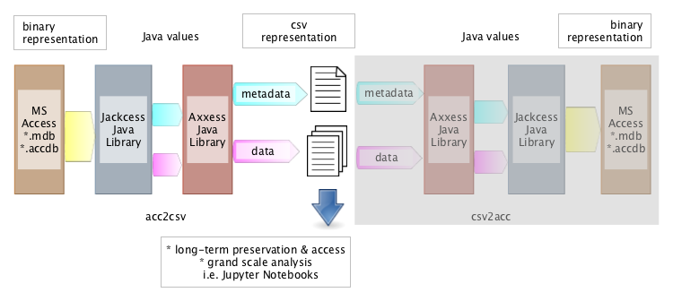

# axxess

Java library to convert ms access databases to csv (and back to ms access again, if needed)



_On top of [Jackcess](http://jackcess.sourceforge.net/) Axxess extracts data and metadata from
MS Access databases and writes these out as comma separated files (.csv)_

With the aid of the excellent java library [Jackcess](http://jackcess.sourceforge.net/),
Axxess extracts data and metadata from binary representations (\*.mdb, \*.accdb files)
of Access and writes these out as comma separated versions (\*.csv files). There is no need to have 
a jet-engine running; you do not need to be on Windows. Axxess was built as part of an
effort to procure data stored in MS Access databases for long-term preservation and access.
Oh, and by the way, Axxess (and Jackcess) can also rebuild MS Access databases from the data and
database metadata stored in the .csv files. That opens the way for (large scale) migration of 
Access databases to newer versions.

### Usage

Axxess can be deployed in several ways:

- as jar-with-dependencies that runs under java 8, configured with a property file
- as a docker container, configured with a property file.
- as a library in your java project

As jar-with-dependencies it can also run within a [Jupyter](http://jupyter.org/) Notebook.
See the examples on [Axxess-Jupyter](https://github.com/DANS-repo/axxess-jupyter).

### Run as jar-with-dependencies

*Prerequisite: Java 8*

Clone and build the project or download the jar from 
the [releases page](https://github.com/DANS-repo/axxess/releases).

In order to run a test and to have a template for the configuration with a properties file
follow these steps:

1. create a directory `example` in the same directory as where you put the `jar-with-dependencies`.
2. download the [example database](https://github.com/DANS-repo/axxess/blob/master/docker/example/db/simple.mdb?raw=true) and put it in the newly created `example` directory.
3. download the [axxess.properties](https://raw.githubusercontent.com/DANS-repo/axxess/master/docker/cfg/axxess.properties) and put it in the same directory as the `jar-with-dependencies`.

Your file and directory structure now looks like:
```
root-|
     |-axxess-jar-with-dependencies.jar
     |-axxess.properties
     |-example-|
               |-simple.mdb

```
From the command line issue:
```
java -jar axxess-jar-with-dependencies.jar axxess.properties
```
If the test ran successfully you'll end up with
```
Converted 1 database(s) to 4 result files, with 0 error(s) and 0 warnings(s).
Converted 1 metadata file(s) to 1 database(s), with 0 error(s) and 0 warning(s)
```
and you will find csv files in `work/axxess-csv-out` and a converted database in `work/axxess-db-out`.

As a second argument you can specify the logback configuration file.
```
java -jar axxess-jar-with-dependencies.jar axxess.properties logback.xml
```

#### Configuration when run as jar-with-dependencies
Configuration can be done with a properties file. An example can be found in
[docker/cfg/axxess.properties](https://github.com/DANS-repo/axxess/blob/master/docker/cfg/axxess.properties).
If not specified as the first argument on the command line Axxess wil look in `cfg/axxess.properties`. 
Nearly all properties can be left to their default settings except for `axxess.mode`, `db.source.file` 
(when used for access to csv) and `csv.source.file` (when used for csv to access).

### Run as a docker container

*Prerequisite: a running docker daemon*

Clone or download the project, make sure your docker daemon is running. From the root of the project
change into the `docker` directory and issue:
```
./start.sh
```
The project will be built and the example database in `example/db` converted to csv and rebuilt as database.
The configuration is in `docker/cfg/axxess.properties` and the result in `docker/work`. Running `start.sh`
another time will skip the docker build phase. To force a rebuild add `-r` to the start command:
```
./start.sh -r
```
Unless you specify other volumes and directories in `Dockerfile` and `docker/start.sh` and rebuild your docker image
all paths in `cfg/properties` will be relative to the `docker/work` directory.

### Usage as a java library

The two centre classes for conversion to and from csv files are `nl.knaw.dans.repo.axxess.acc2csv.Axxess2CsvConverter`
and `nl.knaw.dans.repo.axxess.csv2acc.Csv2AxxessConverter`.

Conversion of ms access to csv:
```
Axxess2CsvConverter a2c = new Axxess2CsvConverter()
              .withTargetDirectory("output/directory")
              .setIncludeManifest(true)
              .setArchiveResults(true)
              ...
              .setCompressArchive(false);
List<File> csvResultFiles = a2c.convert("file/or/directory/to/convert");
```
This will create csv files of the database or all databases found in the directory structure pointed to with
`file/or/directory/to/convert`.  Output directory and directory to convert may point to the same location.
Because of the settings of `setIncludeManifest` and `setArchiveResults`
the csv files will also be zipped and a manifest-sha1.txt will be included. 

Besides the settings in the example other conditions may be programmatically set.

Conversion of csv files back to ms access database(s):
```
Csv2AxxessConverter c2a = new Csv2AxxessConverter()
               .withTargetDirectory("output/directory)
               .withTargetDatabaseFileFormat(Database.FileFormat.V2000)
               .setAutoNumberColumns(false)
               ...
               .setIncludeManifest(true);
List<File> dbResultFiles = c2a.convert("file/or/directory/to/convert");
```
This will recreate databases from the csv files `file/or/directory/to/convert`. 
Output directory and directory to convert may point to the same location.
With the settings shown the recreated database will be access version 2000.


 
